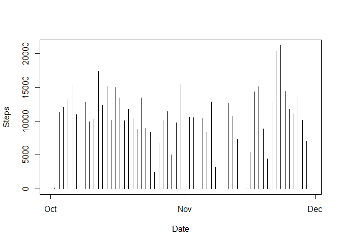
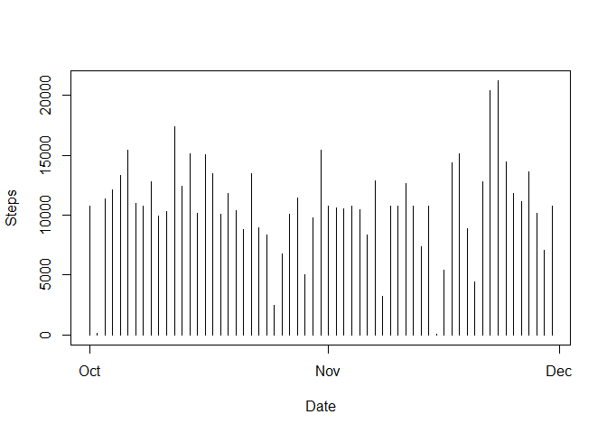
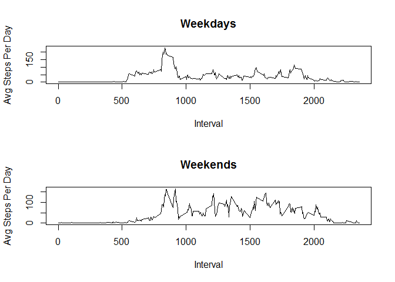

# Reproducible Research: Peer Assessment 1

##Loading and preprocessing the data


```r
require("downloader")
```

```
## Loading required package: downloader
```

```r
download("https://d396qusza40orc.cloudfront.net/repdata%2Fdata%2Factivity.zip", dest="RepData_PeerAssessment1", mode="wb") 
unzip ("repdata_data_activity.zip", overwrite="TRUE", exdir = ".")
data<-read.csv("activity.csv")
```
##What is mean total number of steps taken per day?

Calculate the total number of steps taken per day

```r
steps<-aggregate(data$steps, by=list(date=data$date), FUN=sum, simplify=TRUE)
```
Steps per Day:

```r
print(steps)
```

```
##          date     x
## 1  2012-10-01    NA
## 2  2012-10-02   126
## 3  2012-10-03 11352
## 4  2012-10-04 12116
## 5  2012-10-05 13294
## 6  2012-10-06 15420
## 7  2012-10-07 11015
## 8  2012-10-08    NA
## 9  2012-10-09 12811
## 10 2012-10-10  9900
## 11 2012-10-11 10304
## 12 2012-10-12 17382
## 13 2012-10-13 12426
## 14 2012-10-14 15098
## 15 2012-10-15 10139
## 16 2012-10-16 15084
## 17 2012-10-17 13452
## 18 2012-10-18 10056
## 19 2012-10-19 11829
## 20 2012-10-20 10395
## 21 2012-10-21  8821
## 22 2012-10-22 13460
## 23 2012-10-23  8918
## 24 2012-10-24  8355
## 25 2012-10-25  2492
## 26 2012-10-26  6778
## 27 2012-10-27 10119
## 28 2012-10-28 11458
## 29 2012-10-29  5018
## 30 2012-10-30  9819
## 31 2012-10-31 15414
## 32 2012-11-01    NA
## 33 2012-11-02 10600
## 34 2012-11-03 10571
## 35 2012-11-04    NA
## 36 2012-11-05 10439
## 37 2012-11-06  8334
## 38 2012-11-07 12883
## 39 2012-11-08  3219
## 40 2012-11-09    NA
## 41 2012-11-10    NA
## 42 2012-11-11 12608
## 43 2012-11-12 10765
## 44 2012-11-13  7336
## 45 2012-11-14    NA
## 46 2012-11-15    41
## 47 2012-11-16  5441
## 48 2012-11-17 14339
## 49 2012-11-18 15110
## 50 2012-11-19  8841
## 51 2012-11-20  4472
## 52 2012-11-21 12787
## 53 2012-11-22 20427
## 54 2012-11-23 21194
## 55 2012-11-24 14478
## 56 2012-11-25 11834
## 57 2012-11-26 11162
## 58 2012-11-27 13646
## 59 2012-11-28 10183
## 60 2012-11-29  7047
## 61 2012-11-30    NA
```

Make a histogram of the total number of steps taken each day

```r
plot(x=as.POSIXct(steps$date), y=steps$x, type="h", xlab="Date", ylab="Steps")
```

 

Calculate and report the mean and median of the total number of steps taken per day

```r
print(paste("mean = ", mean(steps$x, na.rm = TRUE)))
```

```
## [1] "mean =  10766.1886792453"
```

```r
print(paste("median = ", median(steps$x, na.rm = TRUE)))
```

```
## [1] "median =  10765"
```
##What is the average daily activity pattern?
Make a time series plot (i.e. type = "l") of the 5-minute interval (x-axis) and the 
average number of steps taken, averaged across all days (y-axis)

```r
intervals<-aggregate(data$steps, list(interval=data$interval), FUN=mean, simplify=TRUE, na.action=na.omit, na.rm=TRUE)
plot(x=intervals$interval, y=intervals$x, type="l", xlab="Interval", ylab="Steps")
```

 
Which 5-minute interval, on average across all the days in the dataset, 
contains the maximum number of steps?

```r
intervals[which.max( intervals[,2] ), ]
```

```
##     interval        x
## 104      835 206.1698
```
##Imputing missing values
Note that there are a number of days/intervals where there are missing values 
(coded as NA). The presence of missing days may introduce bias into some calculations or 
summaries of the data.

Calculate and report the total number of missing values in the dataset 
(i.e. the total number of rows with NAs)

```r
nrow(data[!complete.cases(data),])
```

```
## [1] 2304
```
Devise a strategy for filling in all of the missing values in the dataset. 
The strategy does not need to be sophisticated. For example, you could use the 
mean/median for that day, or the mean for that 5-minute interval, etc.

Create a new dataset that is equal to the original dataset but with the 
missing data filled in.

Missing values are populated with the mean value for that interval, derived from all non-blank values:

```r
completeData<-data
for (i in 1:nrow(completeData)){
  if(is.na(completeData[i, 1])){
    completeData[i, 1] <- intervals[intervals$interval == completeData[i, 3], 2]    
  }
}
```

Make a histogram of the total number of steps taken each day and Calculate and 
report the mean and median total number of steps taken per day. Do these values 
differ from the estimates from the first part of the assignment? What is the 
impact of imputing missing data on the estimates of the total daily number of steps?

```r
steps2<-aggregate(completeData$steps, by=list(date=completeData$date), FUN=sum, simplify=TRUE)
plot(x=as.POSIXct(steps2$date), y=steps2$x, type="h", xlab="Date", ylab="Steps")
```

 

```r
print("Mean & Median of Steps with no NAs:")
```

```
## [1] "Mean & Median of Steps with no NAs:"
```

```r
print(paste("mean = ", mean(steps2$x, na.rm = TRUE)))
```

```
## [1] "mean =  10766.1886792453"
```

```r
print(paste("median = ", median(steps2$x, na.rm = TRUE)))
```

```
## [1] "median =  10766.1886792453"
```

Make a table showing dates, steps with NAs, steps without NAs

```r
require(sqldf)
```

```
## Loading required package: sqldf
## Loading required package: gsubfn
## Loading required package: proto
## Loading required package: RSQLite
## Loading required package: DBI
```

```r
dateCompare<-sqldf("select * from steps left join steps2 using (date, date)")
```

```
## Loading required package: tcltk
```

```r
colnames(dateCompare)<-c("Date", "With NAs", "WithoutNAs")
print(dateCompare, type="html")
```

```
##          Date With NAs WithoutNAs
## 1  2012-10-01       NA   10766.19
## 2  2012-10-02      126     126.00
## 3  2012-10-03    11352   11352.00
## 4  2012-10-04    12116   12116.00
## 5  2012-10-05    13294   13294.00
## 6  2012-10-06    15420   15420.00
## 7  2012-10-07    11015   11015.00
## 8  2012-10-08       NA   10766.19
## 9  2012-10-09    12811   12811.00
## 10 2012-10-10     9900    9900.00
## 11 2012-10-11    10304   10304.00
## 12 2012-10-12    17382   17382.00
## 13 2012-10-13    12426   12426.00
## 14 2012-10-14    15098   15098.00
## 15 2012-10-15    10139   10139.00
## 16 2012-10-16    15084   15084.00
## 17 2012-10-17    13452   13452.00
## 18 2012-10-18    10056   10056.00
## 19 2012-10-19    11829   11829.00
## 20 2012-10-20    10395   10395.00
## 21 2012-10-21     8821    8821.00
## 22 2012-10-22    13460   13460.00
## 23 2012-10-23     8918    8918.00
## 24 2012-10-24     8355    8355.00
## 25 2012-10-25     2492    2492.00
## 26 2012-10-26     6778    6778.00
## 27 2012-10-27    10119   10119.00
## 28 2012-10-28    11458   11458.00
## 29 2012-10-29     5018    5018.00
## 30 2012-10-30     9819    9819.00
## 31 2012-10-31    15414   15414.00
## 32 2012-11-01       NA   10766.19
## 33 2012-11-02    10600   10600.00
## 34 2012-11-03    10571   10571.00
## 35 2012-11-04       NA   10766.19
## 36 2012-11-05    10439   10439.00
## 37 2012-11-06     8334    8334.00
## 38 2012-11-07    12883   12883.00
## 39 2012-11-08     3219    3219.00
## 40 2012-11-09       NA   10766.19
## 41 2012-11-10       NA   10766.19
## 42 2012-11-11    12608   12608.00
## 43 2012-11-12    10765   10765.00
## 44 2012-11-13     7336    7336.00
## 45 2012-11-14       NA   10766.19
## 46 2012-11-15       41      41.00
## 47 2012-11-16     5441    5441.00
## 48 2012-11-17    14339   14339.00
## 49 2012-11-18    15110   15110.00
## 50 2012-11-19     8841    8841.00
## 51 2012-11-20     4472    4472.00
## 52 2012-11-21    12787   12787.00
## 53 2012-11-22    20427   20427.00
## 54 2012-11-23    21194   21194.00
## 55 2012-11-24    14478   14478.00
## 56 2012-11-25    11834   11834.00
## 57 2012-11-26    11162   11162.00
## 58 2012-11-27    13646   13646.00
## 59 2012-11-28    10183   10183.00
## 60 2012-11-29     7047    7047.00
## 61 2012-11-30       NA   10766.19
```

Make a table showing mean and median with NAs, without NAs

```r
avgCompare<-data.frame()
avgCompare[1,1]<-"Mean"
avgCompare[1,2]<-mean(steps$x, na.rm=TRUE)
avgCompare[1,3]<-median(steps$x, na.rm=TRUE)
avgCompare[2,1]<-"Median"
avgCompare[2,2]<-mean(steps2$x, na.rm=TRUE)
avgCompare[2,3]<-median(steps2$x, na.rm=TRUE)
colnames(avgCompare)<-c("Measure", "With NAs", "Without NAs")
print(avgCompare, type="html")
```

```
##   Measure With NAs Without NAs
## 1    Mean 10766.19    10765.00
## 2  Median 10766.19    10766.19
```

##Are there differences in activity patterns between weekdays and weekends?

For this part the weekdays() function may be of some help here. Use the dataset with 
the filled-in missing values for this part.

Create a new factor variable in the dataset with two levels - "weekday" and "weekend" 
indicating whether a given date is a weekday or weekend day.

```r
completeData$day<-weekdays(as.POSIXct(completeData[,2]))
completeData[which(completeData$day=='Saturday'),5]<-"weekend"
completeData[which(completeData$day=='Sunday'),5]<-"weekend"
completeData[which(completeData$day=='Monday'),5]<-"weekday"
completeData[which(completeData$day=='Tuesday'),5]<-"weekday"
completeData[which(completeData$day=='Wednesday'),5]<-"weekday"
completeData[which(completeData$day=='Thursday'),5]<-"weekday"
completeData[which(completeData$day=='Friday'),5]<-"weekday"
colnames(completeData)<-c("steps", "date", "interval", "day", "dayType")
```

```r
factor(completeData$dayType)
```
Make a panel plot containing a time series plot (i.e. type = "l") of the 5-minute 
interval (x-axis) and the average number of steps taken, averaged across all 
weekday days or weekend days (y-axis). See the README file in the GitHub repository 
to see an example of what this plot should look like using simulated data.

```r
steps3<-aggregate(completeData$steps, by=list(dayType=completeData$dayType, interval=completeData$interval), FUN=mean, simplify=TRUE)
steps3a<-steps3[which(steps3$dayType=="weekday"), ]
steps3b<-steps3[which(steps3$dayType=="weekend"), ]
par(mfrow=c(2,1))
plot(x=steps3a$interval, y=steps3a$x, type="l", main="Weekdays", xlab="Interval", ylab="Avg Steps Per Day")
plot(x=steps3b$interval, y=steps3b$x, type="l", main="Weekends", xlab="Interval", ylab="Avg Steps Per Day")
```

 
